# Self-Calibrating, Fault-Tolerant Autonomous Personal Smart Space

## Software Design Document

| Field | Value |
|---|---|
| Document ID | SDD-ESS-001 |
| Version | 1.1 |
| Status | Draft for review |
| Repository | `edge-smart-space` |
| Target platform | NVIDIA Jetson AGX Orin 32 GB (JetPack 6.x) |
| Phase at time of writing | Simulation (pre-hardware) |
| Related documents | Formal Problem Statement v5, Professor Briefing, Review Deck (17 slides), 12-Week Work Plan |

### Revision history

| Version | Change |
|---|---|
| 1.0 | Initial specification. |
| 1.2 | §5.2.1 gains an identification form: the model is fitted on the temperature *change* against `T_out − T`, three parameters instead of four, with `a1` derived as `1 − a2`. E1 measured the previous form's `a1` settling at 0.754 against a truth of 0.998 — errors-in-variables attenuation, since `T[k]` is a noisy regressor — and the reformulation drops `a1`'s error by a factor of 220 and the worst coefficient error from 0.243 to 0.036, at the cost of `a4`. Steady-state consistency becomes structural, so `\|a1+a2−1\|` is retired as a diagnostic (§8.3) and `a4`'s plausible range widens to admit noise-driven excursions below zero. |
| 1.1 | Reconciled with the implementation after Weeks 1–4. Wake-word threshold lowered to a measured value and the always-listening claim in §5.8 qualified accordingly; §4.6 memory budget restated for the models actually loaded; §5.7.5 model selection changed to the served 7B; §5.10 layout updated; `PreferenceHint` added to §6.2. |

Where this document and the code disagree, that is a defect in one of them.
`tests/common/test_design_conformance.py` validates every payload in §6.2
verbatim and asserts the §6.1 topic table matches the code in both
directions, so the parts it covers cannot drift silently.

---

## Table of Contents

1. [Introduction](#1-introduction)
2. [Scope and Boundaries](#2-scope-and-boundaries)
3. [Requirements](#3-requirements)
4. [High-Level Design](#4-high-level-design)
5. [Low-Level Design](#5-low-level-design)
6. [Interface Specifications](#6-interface-specifications)
7. [Failure Modes and Degradation](#7-failure-modes-and-degradation)
8. [Verification and Validation](#8-verification-and-validation)
9. [Deployment and Build](#9-deployment-and-build)
10. [Risks](#10-risks)
11. [Traceability Matrix](#11-traceability-matrix)
12. [Appendices](#12-appendices)

---

## 1. Introduction

### 1.1 Purpose

This document specifies the architecture and detailed design of an autonomous personal smart space that runs entirely on a single edge node. It is the implementation reference for the two-member development team and the basis for review by the project supervisor.

### 1.2 Problem Context

Conventional smart-space automation is threshold-driven and subsystem-siloed. Two consequences matter for this project:

1. **No self-calibration.** A thermostat has no model of the room it controls. It cannot tell the difference between a room that heats slowly because it is well-insulated and one that heats slowly because the air conditioner is failing. Its control gains are fixed at install time and never adapt to the specific thermal characteristics of the space.

2. **No fault tolerance.** When a sensor drifts, sticks, or drops out, a threshold controller continues to act on the bad reading. There is no residual to inspect, no model to fall back on, and no explicit degraded operating mode.

These two gaps are the technical core of this project. Contextual assistance and voice interaction are secondary features that demonstrate the reasoning layer; they are not the contribution.

### 1.3 Design Thesis

The system separates **what to achieve** from **how to achieve it**:

- A reasoning layer (LLM-based) sets *goals* — target setpoints, operating modes, fault hypotheses. It runs at minute-scale cadence and never touches an actuator directly.
- A regulatory layer (classical control) *tracks* those goals using a physically-grounded thermal model that adapts online. It runs at second-scale cadence and is fully deterministic.
- A safety layer *vetoes* any command that violates a hard constraint, regardless of which layer proposed it.

This is a supervisory control architecture. It is chosen deliberately: an LLM cannot be made to satisfy a hard safety bound by prompting, so it is placed where its failure mode is a suboptimal goal rather than an unsafe command.

### 1.4 Definitions

| Term | Definition |
|---|---|
| Regulatory core | Deterministic control loop that tracks a setpoint. No learned components. |
| Supervisor | LLM-driven component that proposes setpoints and operating modes. |
| Validator | Rule-based gate between any proposed command and the actuator driver. |
| Blackboard | Shared state store realised as a set of retained MQTT topics. |
| Residual | Difference between measured temperature and the thermal model's one-step prediction. |
| Self-calibration | Online estimation of the room's thermal coefficients from operating data. |
| Real actuator | A physical device the system commands. Only the air conditioner qualifies. |
| Simulated actuator | A software stand-in with a documented model; commanded identically but has no physical effect. |

---

## 2. Scope and Boundaries

### 2.1 In Scope

- Closed-loop thermal control of a single room using one physical air conditioner.
- Online identification of a four-coefficient RC thermal model via recursive least squares.
- Binary occupancy detection from a PIR sensor and a door reed switch.
- Detection, diagnosis, and compensation of injected sensor and actuator faults.
- One tool-using LLM agent (Environmental Supervisor) plus two single-shot LLM calls.
- Wake-word-gated speech input with on-device transcription and intent extraction.
- A tariff-aware setpoint policy that shifts the comfort band under peak pricing.
- One mock external booking endpoint to demonstrate the confirmation gate.

### 2.2 Explicitly Out of Scope

| Excluded | Reason |
|---|---|
| Multi-actuator coordination | Only one physical actuator exists. Lighting, fan, and blind actuation are simulated and are not claimed as controlled outcomes. |
| Formal multi-objective optimisation | No objective function is defined and no solver is used. The comfort–cost behaviour is a documented deterministic policy, not an optimum. |
| Air quality as a controlled variable | Nothing in the system can influence CO2 or particulate levels. It is not sensed and not controlled. |
| Occupant counting | PIR plus reed switch yields presence, not headcount. All logic downstream assumes a binary signal. |
| Speaker-based authorisation | Speaker verification selects a personalisation profile. It is not a security control and grants no privileges. |
| Live third-party bookings | The booking endpoint is a local mock. No real reservation is ever made. |
| Multi-room or multi-occupant conflict resolution | Single-room, single-occupant testbed. |
| Neural network thermal models | The thermal model is a linear grey-box. This is a design choice, not a limitation to be worked around. |

### 2.3 Assumptions

| ID | Assumption | Impact if violated |
|---|---|---|
| A-01 | The room is thermally single-zone over the control horizon. | Model residuals inflate; RLS coefficients lose physical meaning. |
| A-02 | Sensor sampling interval is uniform at 5 s (±500 ms jitter). | ARX coefficient interpretation breaks; requires resampling. |
| A-03 | The air conditioner accepts and acknowledges IR/ESPHome commands reliably in the absence of injected faults. | Actuator fault detector produces false positives. |
| A-04 | Ambient (outdoor) temperature is available at 60 s cadence or slower. | Zero-order-hold interpolation introduces model bias. |
| A-05 | Jetson AGX Orin is available from Week 4 of the 12-week plan. | Hardware validation compresses into the integration window. |

---

## 3. Requirements

Priority: **M** = mandatory (demo fails without it), **S** = should have, **C** = could have.
Verification: **T** = automated test, **D** = demonstration, **A** = analysis/inspection, **M** = measurement.

### 3.1 Functional Requirements — Sensing and State Estimation

| ID | Requirement | Pri | Ver |
|---|---|---|---|
| FR-01 | The system shall sample indoor temperature and relative humidity at a fixed 5 s interval and publish each reading with a monotonic timestamp and sensor ID. | M | T |
| FR-02 | The system shall derive a binary occupancy state from PIR motion and door reed-switch transitions, with a configurable vacancy hold-off timer (default 10 min). | M | T |
| FR-03 | The system shall acquire outdoor temperature at a cadence of 60 s or faster and hold the last value between updates. | M | T |
| FR-04 | The system shall maintain a four-coefficient RC thermal model of the room and update its coefficients online from operating data, without offline retraining. | M | T |
| FR-05 | The system shall compute a one-step-ahead temperature prediction and a residual at every regulatory tick, and publish both. | M | T |
| FR-06 | The system shall reject coefficient updates that violate documented physical-plausibility bounds, retaining the previous estimate and logging the rejection. | M | T |
| FR-07 | The system shall persist thermal coefficients and covariance to disk at a configurable interval and restore them on restart. | S | T |

### 3.2 Functional Requirements — Control and Actuation

| ID | Requirement | Pri | Ver |
|---|---|---|---|
| FR-10 | The regulatory core shall track a commanded setpoint using a deterministic control law with no learned or stochastic components. | M | T |
| FR-11 | The regulatory core shall continue operating at its nominal cadence when the supervisory layer is unavailable, holding the last valid setpoint. | M | D |
| FR-12 | The system shall command the air conditioner through a single actuator driver that serialises all commands and reports acknowledgement status. | M | T |
| FR-13 | Every actuator command shall pass through the safety validator before transmission. Commands failing validation shall be blocked, replaced by the nearest valid command, and logged with a reason code. | M | T |
| FR-14 | The validator shall enforce: absolute setpoint bounds, setpoint rate-of-change limit, minimum compressor off-time, and maximum command frequency. | M | T |
| FR-15 | Simulated actuators shall expose the identical command interface as the real actuator and shall be labelled `simulated: true` in every published state message. | M | A |
| FR-16 | The system shall shift the comfort band by a configurable offset when the tariff state is `peak`, subject to the same validator bounds as any other setpoint. | S | T |

### 3.3 Functional Requirements — Fault Detection, Diagnosis, Tolerance

| ID | Requirement | Pri | Ver |
|---|---|---|---|
| FR-20 | The system shall detect sensor dropout when no reading arrives from a registered sensor within a configurable timeout (default 3 sampling intervals). | M | T |
| FR-21 | The system shall detect stuck-at sensor faults by monitoring reading variance over a sliding window. | M | T |
| FR-22 | The system shall detect out-of-range readings against per-sensor physical limits. | M | T |
| FR-23 | The system shall detect sensor drift by applying a two-sided CUSUM test to the normalised model residual. | M | T |
| FR-24 | The system shall detect actuator faults by testing for absence of expected thermal response over a configurable evaluation window following a sustained command. | M | T |
| FR-25 | On detection of any fault, the system shall invoke the Fault Diagnosis LLM call with a structured feature vector and obtain a schema-valid hypothesis and recommended degradation mode. | M | T |
| FR-26 | The system shall transition to a documented degradation mode within 2 s of fault confirmation, independently of whether the LLM call succeeds. | M | T |
| FR-27 | In `DEGRADED_SENSOR` mode, the system shall substitute the thermal model prediction for the faulted temperature reading and continue closed-loop control for a bounded duration. | M | D |
| FR-28 | In `DEGRADED_ACTUATOR` mode, the system shall cease closed-loop actuation, hold a safe state, and raise a user notification. | M | D |
| FR-29 | The system shall freeze RLS coefficient adaptation while any sensor feeding the regressor is in a faulted state. | M | T |
| FR-30 | The system shall automatically return to `NORMAL` mode when the fault condition clears and remains clear for a configurable confirmation period. | S | T |
| FR-31 | The system shall support scripted fault injection for all fault classes listed in FR-20 through FR-24 without modifying production code paths. | M | T |

### 3.4 Functional Requirements — Reasoning Layer

| ID | Requirement | Pri | Ver |
|---|---|---|---|
| FR-40 | The Environmental Supervisor shall run as a tool-using agent that reads blackboard state through defined tools and emits a setpoint goal and operating mode. | M | T |
| FR-41 | The Environmental Supervisor shall be invoked on a fixed cadence (default 300 s) and on defined event triggers (occupancy transition, tariff transition, fault confirmation). | M | T |
| FR-42 | Personal Context extraction shall be a single-shot LLM call producing a schema-constrained structured output. It shall not be given tools. | M | A |
| FR-43 | Fault Diagnosis shall be a single-shot LLM call producing a schema-constrained structured output. It shall not be given tools. | M | A |
| FR-44 | All LLM outputs shall be constrained to a declared schema at decode time. Outputs failing post-decode semantic validation shall be discarded and the previous goal retained. | M | T |
| FR-45 | The reasoning layer shall never write directly to an actuator topic. All influence is exerted through the setpoint goal, which the validator gates. | M | A |
| FR-46 | The system shall record every reasoning invocation — inputs, raw output, validation verdict, applied goal — to an append-only audit log. | M | T |
| FR-47 | Total reasoning-layer unavailability shall not stop regulatory control (see FR-11). | M | D |

### 3.5 Functional Requirements — Speech and Assistance

| ID | Requirement | Pri | Ver |
|---|---|---|---|
| FR-50 | Audio capture for transcription shall begin only after local wake-word detection and shall stop at end-of-utterance or a hard timeout. | M | D |
| FR-51 | The system shall transcribe captured audio on-device. No audio shall leave the edge node. | M | A |
| FR-52 | Speaker verification shall select a personalisation profile only. It shall not gate any action, and this shall be stated in user-facing output. | M | A |
| FR-53 | Recognised intents that map to an environmental preference shall be forwarded as a supervisory input, not as a direct actuator command. | M | T |
| FR-54 | Any intent mapping to an external service action shall require explicit user confirmation before the mock endpoint is invoked. | M | D |
| FR-55 | The mock booking endpoint shall be clearly identified as a mock in all logs and user-facing output. | M | A |

### 3.6 Functional Requirements — Observability

| ID | Requirement | Pri | Ver |
|---|---|---|---|
| FR-60 | All inter-component communication shall traverse the MQTT blackboard and shall be observable without attaching a debugger. | M | A |
| FR-61 | The system shall expose current mode, active faults, thermal coefficients, and last applied goal as retained topics. | M | T |
| FR-62 | The system shall record a time-series log sufficient to replay any experiment offline. | M | T |
| FR-63 | The system shall report per-invocation LLM latency and token counts. | S | M |

### 3.7 Non-Functional Requirements

| ID | Requirement | Pri | Ver |
|---|---|---|---|
| NFR-01 | Regulatory loop period shall be 5 s with jitter under 500 ms at the 95th percentile. | M | M |
| NFR-02 | Fault detection latency, from injection to mode transition, shall be under 30 s for dropout and out-of-range faults. | M | M |
| NFR-03 | Environmental Supervisor end-to-end latency shall be under 15 s on the Jetson AGX Orin at MAXN. | M | M |
| NFR-04 | Wake-word to transcript latency shall be under 3 s for utterances up to 10 s. | S | M |
| NFR-05 | Total resident memory of all system processes shall remain under 20 GB, leaving headroom on the 32 GB module. | M | M |
| NFR-06 | The system shall operate with no outbound internet connectivity. | M | D |
| NFR-07 | The system shall recover to a running state within 60 s of an unclean restart, restoring persisted coefficients. | S | T |
| NFR-08 | All components shall run under process supervision and restart automatically on crash. | S | T |
| NFR-09 | The full stack shall run in simulation on a development laptop with no hardware attached. | M | D |

---

## 4. High-Level Design

### 4.1 System Context

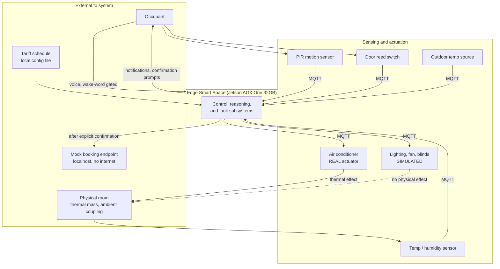

Note the dashed edge: simulated actuators are commanded and their state is published, but they exert no influence on the room. The evaluation never attributes a thermal outcome to them.

### 4.2 Layered Architecture

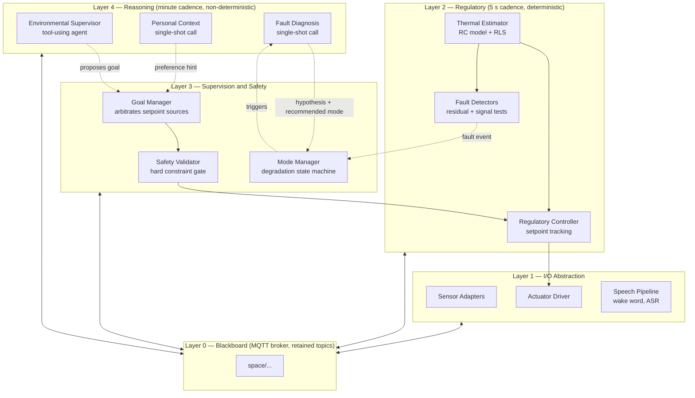

**Cadence separation is the load-bearing idea.** Layer 2 runs every 5 seconds and is the only thing that must be real-time. Layer 4 runs every 300 seconds and is allowed to be slow, occasionally wrong, or entirely absent. Layer 3 is what makes that acceptable.

### 4.3 Control Architecture

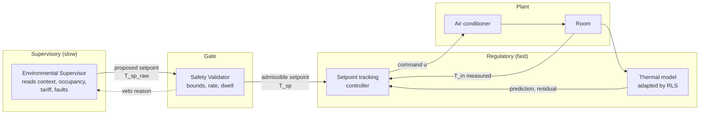

The validator's veto is fed back to the supervisor as context on the next invocation. This is how the reasoning layer learns the constraint envelope without the constraint envelope being negotiable.

### 4.4 Blackboard Topology

All components are MQTT clients. No component holds a direct reference to another. This gives three properties the project needs: any component can be killed and restarted independently (supports FR-11 and FR-47), the entire system state is inspectable with `mosquitto_sub` or `tcpdump` (FR-60), and simulated and real components are interchangeable at the topic level (FR-15, NFR-09).

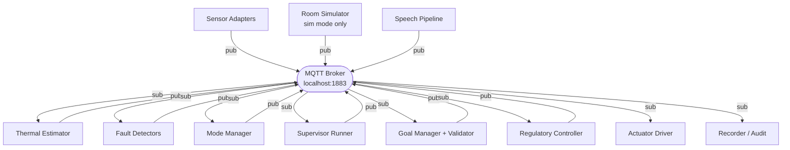

In simulation the Room Simulator replaces the physical sensors and the actuator's thermal effect. Nothing above Layer 1 is aware of which mode is active — this is what lets Weeks 1–4 of work carry over unchanged to hardware.

### 4.5 Deployment View

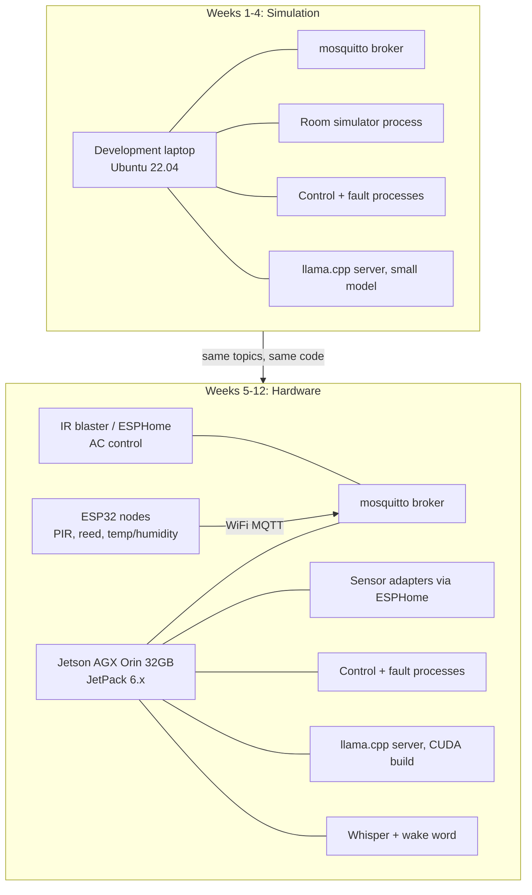

### 4.6 Memory Budget (Jetson AGX Orin 32 GB)

| Component | Estimate | Notes |
|---|---|---|
| JetPack, OS, desktop | 4.0 GB | Headless saves ~1 GB |
| Inference server (Qwen2.5 7B, Q4_K_M, 8k ctx) | 5.5 GB | Weights ~4.4 GB plus KV cache |
| Whisper (`base.en`, float16 on GPU) | 0.5 GB | Loaded on demand after wake word. `int8` on CPU is smaller |
| Wake-word detector | 0.1 GB | Always resident |
| Python control stack, MQTT, logging | 1.5 GB | |
| Headroom | ~20 GB | |

Two rows changed in v1.1 to match what is actually loaded. The inference
server serves a 7B rather than a 9B class model (§5.7.5), and speech runs
`base.en` rather than `small` — smaller, and at half precision on the GPU
rather than `int8` on the CPU, because the project selects CUDA first
(§5.8.1). The net effect is roughly 2 GB more headroom than v1.0 assumed.

Every figure here is an estimate. NFR-05 is enforced by a resident-set check
in CI rather than by this table (§9.2), and E7 measures the real numbers on
the board. Treat a disagreement between this table and E7 as this table being
wrong.

Capacity is not the binding constraint; memory bandwidth is. See NFR-03 for the latency consequence.

---

## 5. Low-Level Design

### 5.1 Module Decomposition

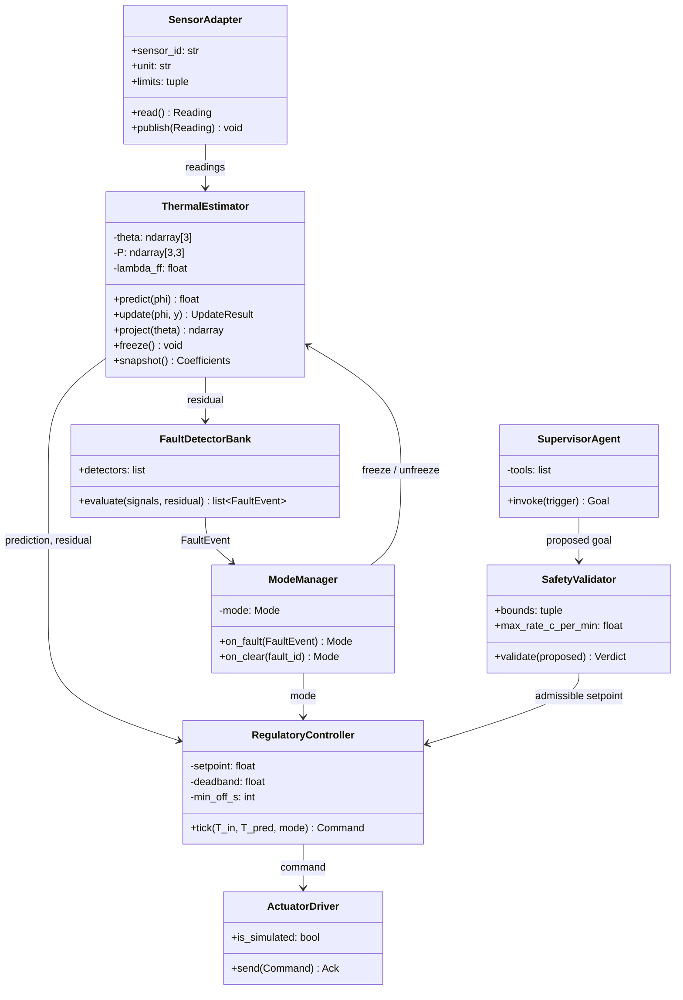

### 5.2 Thermal Model and Self-Calibration

#### 5.2.1 Model Form

The room is modelled as a single thermal capacitance coupled to ambient through a resistance, driven by the air conditioner and by internal gain from occupancy. In continuous time:

```
C · dT/dt = (T_out − T) / R  +  Q_hvac  +  Q_occ
```

Discretising with a zero-order hold at sampling interval Δt and grouping constants gives a form that is **linear in the parameters** — which is what makes recursive least squares applicable without any nonlinear optimisation:

```
T[k+1] = a1·T[k] + a2·T_out[k] + a3·u[k] + a4·o[k]
```

| Coefficient | Physical meaning | Plausible range |
|---|---|---|
| `a1` | Thermal inertia. Fraction of current temperature retained per step. | (0, 1) |
| `a2` | Ambient coupling, ≈ Δt/(R·C). | (0, 1) |
| `a3` | Actuator authority per unit command. Negative for cooling. | (−2.0, 0) |
| `a4` | Internal gain from occupancy. | (−0.05, 1.0) |

Two structural facts are worth stating because they are what turns this from curve-fitting into identification:

- **Steady-state consistency.** With `u = 0` and `o = 0`, the model settles to `T_out` only if `a1 + a2 = 1`.
- **Sign-constrained authority.** `a3` must remain negative in cooling mode. An estimate crossing zero means the identifier is being told the air conditioner heats the room — which is far more likely to be an actuator fault than a genuine thermal property. This link is exploited in FR-24.

##### Identification form

The equation above is what the model *means*. It is not the form the coefficients are identified in, and the difference is not cosmetic.

`a1` is close to 1 — for a room with a 35 min time constant sampled at 5 s it is 0.998, because almost nothing changes in five seconds. Fitting a coefficient that close to 1 requires resolving the small part that does change, and that part is about 0.019 °C per step while the temperature sensor is accurate to ±0.15 °C. Least squares does not merely become imprecise here. `T[k]` appears on both sides of the equation — as the regressor and inside the measurement being predicted — and when a regressor carries measurement error its coefficient is pulled systematically toward zero. The attenuation factor is `var(T) / (var(T) + var(noise))`, which for this room and sensor is about 0.78; measured over a 24 h run, `a1` settled at 0.754 against a truth of 0.998, with `a2` absorbing the difference.

Substituting the steady-state identity `a2 = 1 − a1` into the model and rearranging removes the problem rather than mitigating it:

```
T[k+1] − T[k] = a2·(T_out[k] − T[k]) + a3·u[k] + a4·o[k]        a1 := 1 − a2
```

Identical physics, the same four coefficients, still linear in the parameters, still ordinary recursive least squares. What changes is that the fit is asked for a small number (`a2` ≈ 0.002) instead of a number near 1, and small coefficients are what survive a noisy regressor. `a1` is then recovered rather than fitted, which makes steady-state consistency **structural**: `a1 + a2 = 1` holds exactly, by construction, instead of being a soft constraint that has to be checked afterwards.

Measured over a 24 h simulated run against a plant with known R and C (E1, §8.3):

| | truth | old form | error | identification form | error |
|---|---|---|---|---|---|
| `a1` | 0.997622 | 0.754398 | 0.243224 | 0.996518 | **0.001104** |
| `a2` | 0.002378 | 0.207152 | 0.204774 | 0.003482 | **0.001104** |
| `a3` | −0.020809 | −0.015891 | 0.004917 | −0.020933 | **0.000125** |
| `a4` | 0.000832 | 0.005934 | 0.005102 | 0.036342 | 0.035510 |
| worst | | | 0.243224 | | **0.035510** |

`a1` improves by a factor of 220 and `a3` by 40. `a4` gets worse, and that is the honest cost of the change rather than a defect: occupancy gain is the one coefficient the old form happened to estimate adequately, and it is now the worst of the four.

Two consequences follow and are recorded here rather than discovered later:

- **`|a1 + a2 − 1|` is no longer a diagnostic.** It is identically zero in this form. What it used to detect — the fit drifting away from a physically coherent model — now shows up as `a2` leaving its plausible range, so the box in the table above carries that job alone.
- **`a4` is the weakest coefficient, and the change makes it weaker.** Occupancy gain is around 0.0008 for a single occupant, far below the noise floor. The old form put it within 0.005 of truth; this one is out by 0.036. That is accepted deliberately: `a4` contributes about 0.03 °C to a prediction, so its error costs less than `a1`'s did, and no formulation identifies it well at this signal level. Its plausible range widens to `(−0.05, 1.0)` for the same reason — rejecting every noise-driven excursion below zero would raise `MODEL_DIVERGENCE` constantly for a coefficient the control law barely uses.

#### 5.2.2 RLS Update

Regressor and parameter vectors:

```
φ[k] = [ T_out[k] − T[k],   u[k],   o[k] ]ᵀ
θ    = [ a2,                a3,     a4   ]ᵀ
```

Three parameters are identified, not four. `a1` is recovered as `1 − a2` whenever the model is published or evaluated, which is what makes steady-state consistency exact rather than approximate (§5.2.1). The target is the temperature *change*:

```
y[k] = T[k+1] − T[k]
```

Per-step update with exponential forgetting factor λ:

```
Δ̂[k]  = θ[k−1]ᵀ φ[k]                                 # predicted change
ŷ[k]  = T[k] + Δ̂[k]                                  # one-step prediction
e[k]  = T[k+1] − ŷ[k]                                 # residual  (FR-05)
g[k]  = P[k−1] φ[k] / ( λ + φ[k]ᵀ P[k−1] φ[k] )       # gain
θ[k]  = θ[k−1] + g[k] · e[k]                          # parameter update
P[k]  = ( P[k−1] − g[k] φ[k]ᵀ P[k−1] ) / λ            # covariance update
```

| Parameter | Value | Rationale |
|---|---|---|
| λ (forgetting factor) | 0.995 | Effective memory ≈ 1/(1−λ) = 200 samples ≈ 17 min at 5 s. Tracks daily thermal variation without chasing noise. |
| P₀ | 100·I₃ | Large initial covariance: weak prior, fast initial convergence. |
| θ₀ | [0.02, −0.05, 0.01] | Coarse physical guess for `[a2, a3, a4]`, so the first minutes of control are not wild. `a1` follows as 0.98. |

#### 5.2.3 Numerical and Physical Safeguards

These implement FR-06 and are the difference between "we ran RLS" and "we ran RLS on a real system for twelve weeks".

| Safeguard | Mechanism |
|---|---|
| Covariance windup | Trace bound: if `trace(P) > P_max`, rescale `P ← P · P_max/trace(P)`. Prevents blow-up during periods of low excitation (e.g. AC off overnight). |
| Symmetry loss | After each update, symmetrise: `P ← (P + Pᵀ)/2`. |
| Insufficient excitation | Skip the update when `‖φ[k]‖` variation over the last window falls below a threshold. A constant regressor carries no information and only degrades `P`. |
| Implausible parameters | Test `θ` against the box in §5.2.1, `a1` included after deriving it. An estimate outside the box is **reverted**, not clamped: a projected vector is a point the data never supported, and adopting it would let one bad update park the estimate on a box edge and stay there. Log the rejection with the coefficient that broke; three consecutive rejections raise a `MODEL_DIVERGENCE` fault. |
| Faulted inputs | Freeze adaptation entirely while any regressor sensor is faulted (FR-29). Never adapt to bad data. |

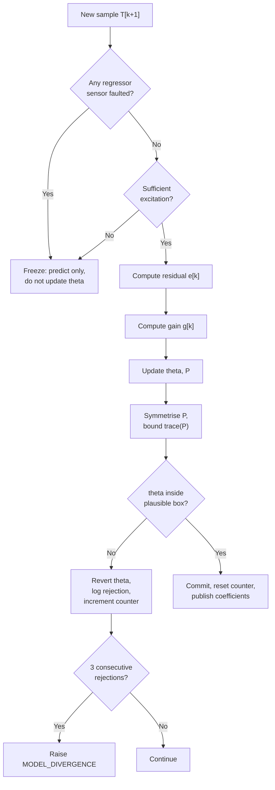

### 5.3 Regulatory Controller

Deterministic, no learned components (FR-10). The controller uses the adapted model for feed-forward prediction while keeping feedback authority in a conventional deadband law with dwell-time protection. The model informs the controller; it does not replace it.

```
inputs:   T_in (measured or substituted), T_sp (validated), mode, T_pred
state:    compressor_state, last_transition_time

on tick (every 5 s):
    if mode in {DEGRADED_ACTUATOR, SAFE_HOLD}:
        emit HOLD; return

    T_eff = T_pred if mode == DEGRADED_SENSOR else T_in

    error = T_eff − T_sp
    elapsed = now − last_transition_time

    if compressor_state == OFF and error > +deadband and elapsed ≥ min_off_s:
        cmd = COOL(setpoint = T_sp)
    elif compressor_state == ON and error < −deadband:
        cmd = OFF
    else:
        cmd = MAINTAIN

    emit cmd
```

| Parameter | Default | Note |
|---|---|---|
| `deadband` | 0.5 °C | Symmetric. Prevents chatter around the setpoint. |
| `min_off_s` | 180 s | Compressor protection. Enforced here *and* independently in the validator. |
| tick period | 5 s | NFR-01. |

The `DEGRADED_SENSOR` substitution is the concrete payoff of having a model: closed-loop control continues on a prediction rather than collapsing to open-loop. It is bounded — see §7.2.

### 5.4 Safety Validator

The validator is the only component permitted to be paranoid. It has no knowledge of intent and applies rules unconditionally (FR-13, FR-14).

| Rule | Check | Action on violation |
|---|---|---|
| V-1 Absolute bounds | `18.0 ≤ T_sp ≤ 30.0` | Clamp to nearest bound. Reason: `BOUND_CLAMP`. |
| V-2 Rate limit | `\|T_sp − T_sp_prev\| ≤ 2.0 °C` per invocation | Clamp to max step. Reason: `RATE_LIMIT`. |
| V-3 Compressor dwell | No ON command within `min_off_s` of last OFF | Downgrade to `MAINTAIN`. Reason: `DWELL`. |
| V-4 Command rate | ≤ 1 actuator command per 30 s | Suppress. Reason: `CMD_RATE`. |
| V-5 Mode consistency | No actuation command while mode is `DEGRADED_ACTUATOR` or `SAFE_HOLD` | Block. Reason: `MODE_BLOCK`. |
| V-6 Staleness | Reject any goal whose source timestamp is older than 600 s | Retain previous goal. Reason: `STALE_GOAL`. |

Every verdict is published to `space/audit/validation` with the proposal, the verdict, the reason code, and the applied value. A clamped supervisor proposal is a finding, not a failure — it is evidence the gate works, and the review deck should present it that way.

### 5.5 Fault Detection

Five detectors run in parallel at regulatory cadence. Each emits a `FaultEvent` with a confidence and the evidence window.

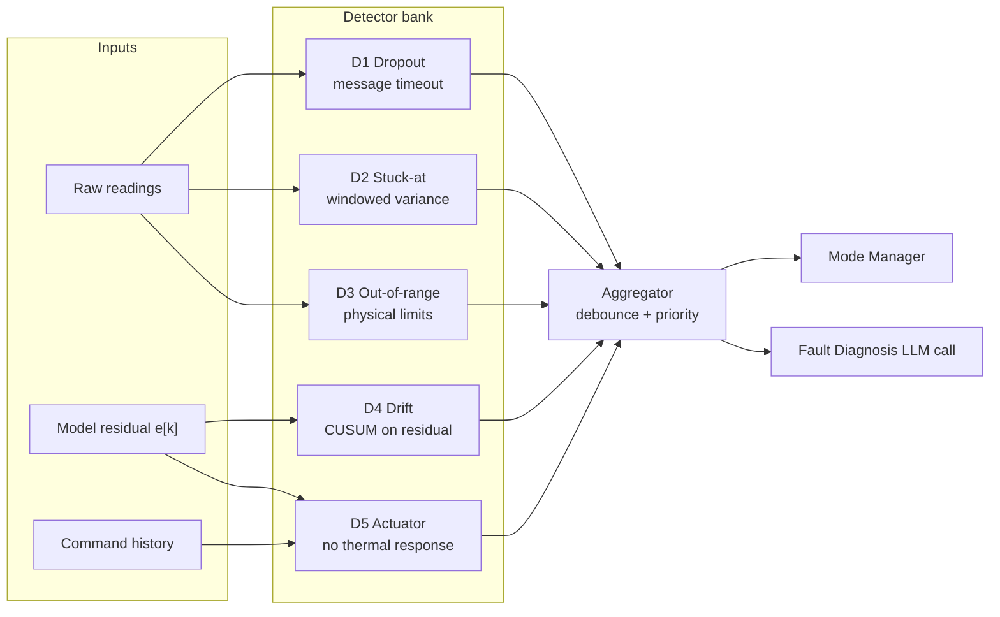

| ID | Method | Parameters | Latency target |
|---|---|---|---|
| D1 | No message on topic within timeout | 3 × sample interval = 15 s | < 20 s |
| D2 | `var(window) < ε` for N consecutive windows | window = 60 samples, ε = 0.001 °C² | < 60 s |
| D3 | Reading outside `[−10, 60] °C` or `[0, 100] %RH` | immediate, 2-sample debounce | < 10 s |
| D4 | Two-sided CUSUM on `e[k]/σ̂` | drift k = 0.5σ, threshold h = 5σ | < 300 s |
| D5 | `\|ΔT\|` below threshold over evaluation window after sustained COOL | window = 600 s, threshold = 0.3 °C | < 600 s |

**On D4 and D5:** these are the two detectors that only exist because the model exists. A threshold thermostat can implement D1–D3 trivially. It cannot implement D4 or D5 at all, because it has no expectation to compare against. That asymmetry is the fault-tolerance argument in one sentence, and it belongs in the evaluation chapter.

**On D5's parameters:** the 600 s window is long because a room's thermal time constant is long. This is an honest limit — actuator faults are detected on the order of ten minutes, not seconds, and NFR-02 deliberately does not promise otherwise.

### 5.6 Mode State Machine

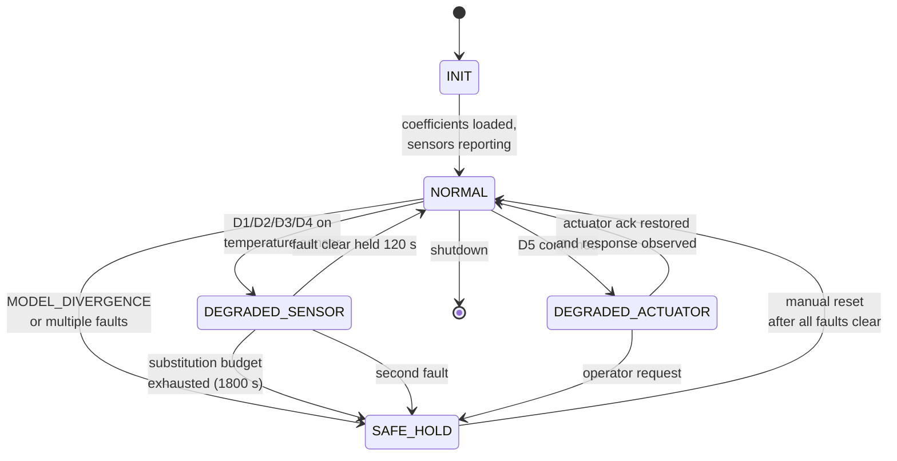

| Mode | Adaptation | Actuation | Notification |
|---|---|---|---|
| `INIT` | frozen | blocked | none |
| `NORMAL` | active | full closed loop | none |
| `DEGRADED_SENSOR` | frozen (FR-29) | closed loop on prediction, time-boxed | banner |
| `DEGRADED_ACTUATOR` | frozen | blocked, hold state | alert + reason |
| `SAFE_HOLD` | frozen | blocked | alert, manual reset required |

Mode transition is driven by the detector bank and completes within 2 s (FR-26). The Fault Diagnosis LLM call runs *in parallel* and enriches the notification — it never sits on the critical path. If the model is unloaded, slow, or produces an invalid output, the transition has already happened.

### 5.7 Reasoning Layer

#### 5.7.1 Component Split

| Component | Type | Tools | Cadence | Failure behaviour |
|---|---|---|---|---|
| Environmental Supervisor | Tool-using agent | 4 read tools, 1 emit tool | 300 s + events | Retain previous goal |
| Personal Context | Single-shot, schema-constrained | none | On transcript | Discard, no preference hint |
| Fault Diagnosis | Single-shot, schema-constrained | none | On fault confirm | Generic notification text |

Only one component genuinely needs a tool loop. Calling the other two "agents" would be a naming convention, not an architecture, so they are specified as what they are: constrained single-shot calls.

#### 5.7.2 Supervisor Tool Surface

| Tool | Signature | Returns |
|---|---|---|
| `get_thermal_state` | `()` | `T_in`, `T_out`, `T_sp`, residual, coefficients, model confidence |
| `get_occupancy` | `()` | `occupied: bool`, `last_transition_ts`, `vacancy_duration_s` |
| `get_tariff_state` | `()` | `band: normal\|peak`, `next_transition_ts` |
| `get_active_faults` | `()` | list of `{fault_id, class, sensor, since_ts, mode_impact}` |
| `propose_setpoint` | `(setpoint_c: float, mode: str, rationale: str)` | validator verdict |

`propose_setpoint` is the terminal tool. It writes to `space/blackboard/goal/proposed`, never to an actuator topic (FR-45).

#### 5.7.3 Decoding Strategy

Two distinct mechanisms, applied to different calls, for reasons given in §5.7.4:

- **Environmental Supervisor** — the model's native tool-call template, served by whichever endpoint is running (`llama-server --jinja`, or Ollama's equivalent). The model's tool-calling post-training is the thing being relied on; overriding its template with a hand-written grammar discards that training.
- **Personal Context and Fault Diagnosis** — a constrained decode. `llama.cpp` exposes this as a GBNF grammar; the OpenAI-compatible endpoint exposes it as a JSON response format. Both constrain the decode, and §5.7.4 applies to either: neither makes the content correct, which is why post-decode validation runs regardless.

#### 5.7.4 What Grammar Constraint Does and Does Not Buy

This distinction must be stated plainly in the evaluation chapter, because it is easy to overstate:

> GBNF guarantees the output *parses*. It says nothing about whether the tool chosen was the right one or the arguments were sensible. Schema-validity is therefore not a result — it is 100% by construction, and reporting it as an achievement would be misleading.

Consequently the system applies **post-decode semantic validation** as a separate stage (FR-44), and the evaluation reports tool-selection accuracy and argument plausibility as distinct metrics from schema validity.

| Stage | Enforces | Failure action |
|---|---|---|
| Decode-time (grammar / template) | Syntactic form, field presence, types | Cannot fail by construction |
| Post-decode semantic check | Ranges, enum membership, internal consistency, staleness | Discard output, retain previous goal, log |
| Safety validator | Hard physical constraints | Clamp or block, log reason code |

#### 5.7.5 Model Selection

| Slot | Candidate | Quant | Notes |
|---|---|---|---|
| Primary | Qwen2.5 7B Instruct | Q4_K_M | Native tool template, reasoning mode disabled — thinking tokens are unaffordable at this cadence |
| Fallback | Llama 3.1 8B Instruct | Q4_K_M | Well-documented on Jetson; useful as a reproducibility baseline |
| Simulation phase | Qwen2.5 7B Instruct | Q4_K_M | The same model, so a simulation result and a hardware result are comparable |

Changed in v1.1 from a 9B class model. The reason for the original choice —
native tool-calling post-training, which the Environmental Supervisor depends
on — is satisfied by Qwen2.5 7B, and the smaller model leaves the memory
headroom in §4.6. Running the same weights in simulation and on hardware also
removes a variable: a difference between the two phases is then a difference
in the system, not in the model.

A **single** server instance serves all three call sites, differentiated by
system prompt and constraint mechanism. Model swapping costs tens of seconds
of load time on Jetson and buys nothing here.

The endpoint is OpenAI-compatible and reached over HTTP, which both
`llama.cpp`'s server and Ollama expose. Nothing in the system depends on which
is running, and neither is started by the project: `start.py` checks the
endpoint is reachable and proceeds without it if it is not, because FR-47
requires regulatory control to survive total reasoning unavailability.

### 5.8 Speech Pipeline

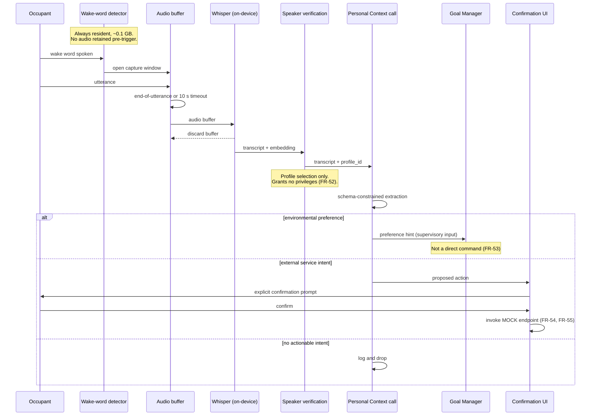

Audio never persists beyond transcription and never leaves the node (FR-51). The capture window opens only after wake-word detection (FR-50).

#### 5.8.1 Wake-word threshold, and what it costs

v1.0 claimed the system "is not always-listening in the sense that matters".
That claim is narrowed here, because measurement contradicted the form it was
written in.

The openWakeWord `hey_jarvis` model is trained on American-accented speech and
does not fire reliably for this team at the conventional threshold of 0.5. At
0.1 it detects consistently, so 0.1 is the configured value. This is a finding
about the model, not a tuning preference, and it has a cost that has to be
stated rather than discovered during the demonstration:

- **What still holds.** Capture only ever begins after a detection, the buffer
  is discarded as soon as transcription finishes, and no audio leaves the node.
  FR-50 and FR-51 are structural and unaffected by the threshold.
- **What no longer holds.** At 0.1 the detector fires on speech it should not,
  and on some background noise. The microphone is therefore *open* more often
  than a 0.5 threshold would allow, so the system cannot claim a low false-wake
  rate — only that every capture window was opened by something the detector
  scored as the wake word.

The honest statement is the second one. Raising the threshold requires either
retraining the wake word on the team's own speech or substituting a model that
generalises better, and either is a change with evidence behind it rather than
a number edited upward to make a sentence true.

Speech is the lowest-priority feature set (R-05) and FR-50 to FR-55 are
cuttable, so this does not affect success criteria 1 to 5.

#### 5.8.2 Compute placement

Wake-word detection and transcription select CUDA first and fall back to CPU
(§4.6). The fallback is reported rather than silent: on the Jetson the
difference between running on the GPU and having quietly dropped to the CPU is
the difference between meeting NFR-04 and missing it, and §9.2 records that a
silent fallback is the failure most likely to be mistaken for slow code.

### 5.9 Key Sequences

#### 5.9.1 Nominal Supervisory Cycle

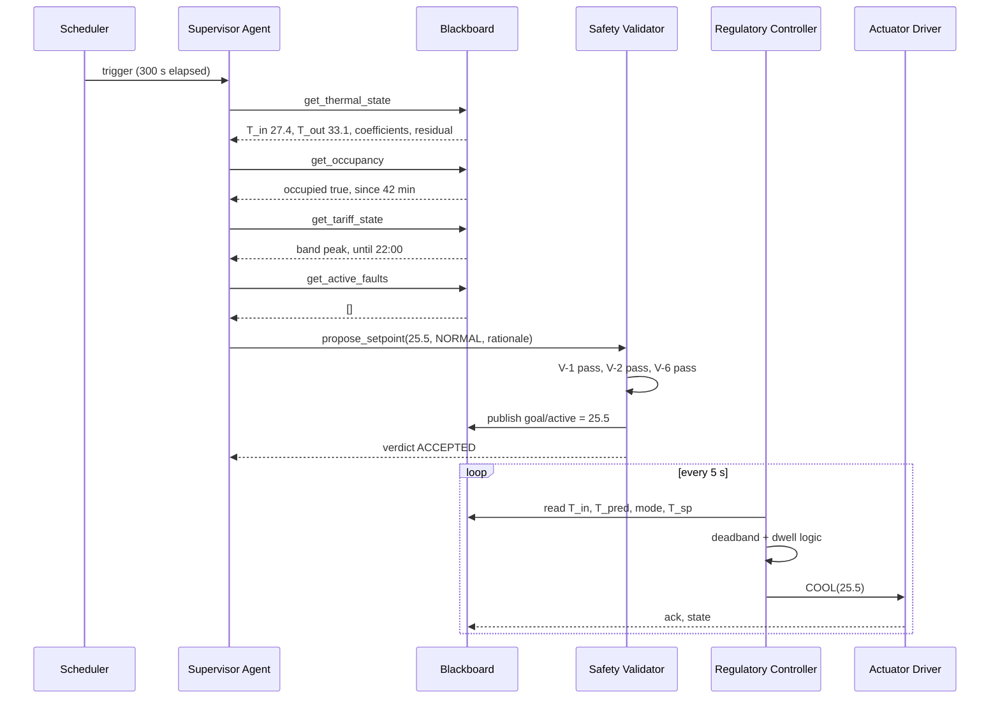

#### 5.9.2 Sensor Fault Injection and Recovery

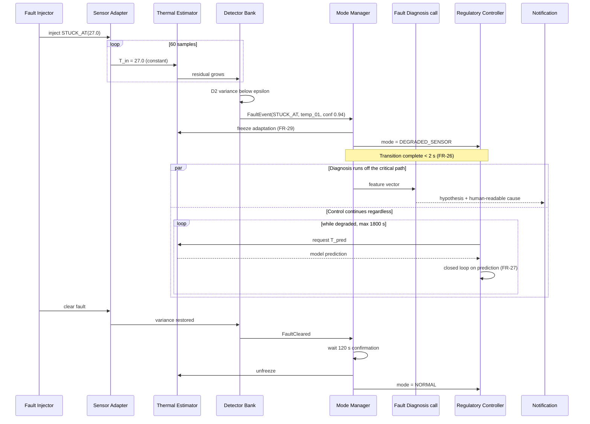

The `par` block is the design point: diagnosis quality and diagnosis latency are decoupled. The LLM improves the *explanation*; it is not permitted to delay the *response*.

### 5.10 Repository Layout

```
edge-smart-space/
├── README.md                      # setup, running, what is not built yet
├── start.py                       # launches every service; preflights the broker
├── setup_models.py                # fetches wake-word weights at setup, not startup
├── pyproject.toml                 # one dependency manifest; core + dev + speech extras
├── config/
│   └── default.yaml               # every tunable; no policy number lives in code
├── docs/
│   ├── DESIGN.md                  # this document
│   ├── coding-guidelines.md
│   └── adr/                       # architecture decision records
│       ├── 0001-supervisory-control.md
│       ├── 0002-rc-model-over-nn.md
│       ├── 0003-binary-occupancy.md
│       └── 0004-single-real-actuator.md
├── src/
│   ├── common/
│   │   ├── clock.py               # injected time source; only module calling `time`
│   │   ├── config.py              # typed, validated configuration
│   │   ├── device.py              # CUDA-first device selection
│   │   ├── schemas.py             # pydantic message schemas
│   │   ├── topics.py              # canonical topic constants
│   │   └── mqtt_client.py
│   ├── io/
│   │   ├── sensor_adapters/
│   │   ├── actuator_driver.py
│   │   └── simulated_actuators.py
│   ├── estimation/
│   │   ├── rc_model.py
│   │   ├── rls.py
│   │   └── persistence.py
│   ├── control/
│   │   ├── regulatory.py
│   │   ├── goal_manager.py
│   │   └── validator.py
│   ├── faults/
│   │   ├── detectors/
│   │   ├── aggregator.py
│   │   ├── mode_manager.py
│   │   └── injector.py
│   ├── reasoning/
│   │   ├── supervisor_agent.py
│   │   ├── tools.py
│   │   ├── single_shot.py
│   │   ├── grammars/*.gbnf
│   │   └── prompts/
│   └── speech/
│       ├── __main__.py            # `python -m src.speech` runs the pipeline
│       ├── wakeword.py
│       ├── audio_capture.py       # bounded queue, background reader
│       ├── asr.py                 # endpointing and transcription
│       ├── pipeline.py            # wake -> capture -> transcribe -> extract
│       └── speaker_profile.py
├── sim/
│   ├── room_model.py              # ground-truth plant, distinct from estimator
│   ├── sensors.py                 # noise, quantisation, dropout, injected faults
│   ├── actuator.py                # dead time, command loss, no acknowledgement
│   ├── scenarios/
│   └── run_sim.py
├── eval/
│   ├── baseline_thermostat.py
│   ├── metrics.py
│   └── experiments/
├── deploy/
│   ├── docker-compose.yml
│   ├── systemd/
│   └── esphome/
├── .github/workflows/ci.yml
└── tests/
```

Written as of v1.1, the following are specified above but **not yet
implemented**: everything under `src/estimation/` and `src/faults/`,
`goal_manager.py`, `supervisor_agent.py`, `tools.py`, `speaker_profile.py`
(FR-52), `simulated_actuators.py`, and the whole of `eval/` and `deploy/`.
They are listed because they are the design, and named here so the gap
between the document and the tree is explicit rather than discovered.

`start.py` and `setup_models.py` are additions to the v1.0 layout. Neither is
a component: `start.py` is the development and demonstration launcher, and on
the Jetson the deployment path remains one `systemd` unit per process (§9.3).
`setup_models.py` exists because wake-word weights were being downloaded at
startup, which NFR-06 forbids.

**`sim/room_model.py` must not import from `src/estimation/`.** The simulated plant and the estimator's internal model have to be independently parameterised, or the evaluation degenerates into the model predicting itself and every reported result is vacuous.

---

## 6. Interface Specifications

### 6.1 MQTT Topic Schema

| Topic | Dir | Retained | QoS | Payload |
|---|---|---|---|---|
| `space/sensor/{id}/state` | pub | no | 0 | `SensorReading` |
| `space/sensor/{id}/health` | pub | yes | 1 | `SensorHealth` |
| `space/estimate/thermal` | pub | yes | 0 | `ThermalEstimate` |
| `space/estimate/coefficients` | pub | yes | 1 | `Coefficients` |
| `space/fault/{fault_id}` | pub | yes | 1 | `FaultEvent` |
| `space/system/mode` | pub | yes | 1 | `ModeState` |
| `space/goal/proposed` | pub | no | 1 | `Goal` |
| `space/goal/active` | pub | yes | 1 | `Goal` |
| `space/actuator/ac/command` | pub | no | 1 | `Command` |
| `space/actuator/ac/state` | pub | yes | 1 | `ActuatorState` |
| `space/actuator/{sim_id}/state` | pub | yes | 1 | `ActuatorState` with `simulated: true` |
| `space/context/preference` | pub | no | 1 | `PreferenceHint` |
| `space/audit/validation` | pub | no | 1 | `ValidationVerdict` |
| `space/audit/reasoning` | pub | no | 1 | `ReasoningRecord` |

### 6.2 Core Message Schemas

```jsonc
// SensorReading
{
  "sensor_id": "temp_01",
  "ts": 1756032000.123,          // unix epoch, monotonic-derived
  "value": 27.4,
  "unit": "C",
  "quality": "ok"                // ok | suspect | faulted
}

// ThermalEstimate
{
  "ts": 1756032000.123,
  "t_in": 27.4,
  "t_pred": 27.31,
  "residual": 0.09,
  "residual_sigma": 0.12,
  "model_confidence": 0.87,      // derived from trace(P), not a probability
  "adaptation": "active"         // active | frozen
}

// Coefficients
{
  "ts": 1756032000.123,
  "a1": 0.9827, "a2": 0.0173, "a3": -0.0421, "a4": 0.0094,
  "trace_p": 0.0031,
  "steady_state_residual": 0.0,      // |a1 + a2 - 1|; identically zero since v1.2
  "samples_since_reset": 14203
}

// FaultEvent
{
  "fault_id": "f_temp01_stuck_1756032",
  "detector": "D2_STUCK_AT",
  "subject": "temp_01",
  "class": "sensor",             // sensor | actuator | model
  "confidence": 0.94,
  "detected_ts": 1756032300.0,
  "evidence": { "window_s": 300, "variance": 0.0002 },
  "mode_impact": "DEGRADED_SENSOR"
}

// Goal
{
  "ts": 1756032000.0,
  "source": "supervisor",        // supervisor | preference | default | operator
  "setpoint_c": 25.5,
  "mode": "NORMAL",
  "rationale": "Occupied 42 min, peak tariff until 22:00, band shifted +1.0 C",
  "expires_ts": 1756032600.0
}

// ValidationVerdict
{
  "ts": 1756032000.4,
  "proposed": { "setpoint_c": 23.0 },
  "verdict": "CLAMPED",          // ACCEPTED | CLAMPED | BLOCKED
  "reason": "RATE_LIMIT",
  "applied": { "setpoint_c": 25.5 }
}

// PreferenceHint
{
  "ts": 1756032000.0,
  "intent": "environment",       // environment | service | none
  "comfort": "cooler",           // warmer | cooler | unchanged
  "subject": "temperature",      // what was asked about; "" when nothing was
  "target_c": 24.0,              // null when no temperature was named
  "rationale": "it is too warm in here",
  "spoken_reply": "I have passed that on."
}
```

### 6.3 Fault Diagnosis Output Schema (GBNF-constrained)

```jsonc
{
  "primary_hypothesis": "sensor_stuck",   // enum, fixed set
  "confidence": "high",                   // low | medium | high
  "supporting_evidence": ["variance_collapse", "residual_step"],
  "recommended_mode": "DEGRADED_SENSOR",  // enum, must be reachable from current mode
  "user_message": "Temperature sensor appears stuck. Running on the room model."
}
```

`recommended_mode` is checked against the state machine's legal transitions before use. An illegal recommendation is discarded and the detector-derived mode stands.

### 6.4 On `PreferenceHint`

Added in v1.1. §6.1 named the message from the start but left its fields
unspecified, and the first implementation carried only a comfort direction and
a temperature, so a request about anything else was discarded for naming no
number.

`intent` is the three-way branch §5.8's sequence already describes.
`environment` is forwarded to the goal path as a supervisory input (FR-53);
`service` is reported and waits for explicit confirmation before any external
endpoint is invoked (FR-54); `none` is the ordinary case of nothing being
asked. An intent of `none` may not carry a comfort direction or a target, so a
discarded extraction cannot smuggle a request past the goal path.

`spoken_reply` is what to say back to the occupant. It is a sentence, not an
action: nothing that produces this message can move an actuator, and the
prompt that generates it forbids claiming anything was changed (FR-45).

---

## 7. Failure Modes and Degradation

### 7.1 Failure Mode Table

| Failure | Detection | System response | Requirement |
|---|---|---|---|
| Temperature sensor dropout | D1 | `DEGRADED_SENSOR`, control on prediction | FR-20, FR-27 |
| Temperature sensor stuck | D2 | `DEGRADED_SENSOR`, freeze RLS | FR-21, FR-29 |
| Temperature sensor out of range | D3 | `DEGRADED_SENSOR` | FR-22 |
| Temperature sensor drift | D4 | `DEGRADED_SENSOR`, flag for recalibration | FR-23 |
| PIR failure | D1/D2 | Occupancy assumed `true` (conservative for comfort) | FR-02 |
| Air conditioner no response | D5 | `DEGRADED_ACTUATOR`, hold, alert | FR-24, FR-28 |
| MQTT broker down | Client disconnect callback | Each process holds last state; controller holds last setpoint | FR-11 |
| LLM server down or slow | Invocation timeout (30 s) | Retain previous goal; regulatory loop unaffected | FR-47 |
| Whisper OOM | Exception on load | Speech feature disabled; core control unaffected | NFR-05 |
| RLS divergence | 3 consecutive rejections | `SAFE_HOLD`, coefficients reset to θ₀ | FR-06 |
| Unclean restart | Boot sequence | Restore persisted θ, P; if stale > 24 h, reset to θ₀ | FR-07, NFR-07 |

### 7.2 Degradation Budget

`DEGRADED_SENSOR` is time-boxed at 1800 s. The justification: the RC model's prediction is only trustworthy over a horizon short relative to the drift of unmodelled disturbances (solar gain, door openings, appliance heat). Beyond roughly half an hour of open-loop-on-prediction operation, the accumulated error is not bounded by anything the system can observe.

Stating this budget explicitly — rather than claiming indefinite ride-through — is the honest position, and the experiment in §8.3 is designed to measure where prediction error actually crosses an acceptable bound rather than assuming 1800 s is correct.

---

## 8. Verification and Validation

### 8.1 Test Levels

| Level | Scope | Environment |
|---|---|---|
| Unit | RLS update, projection, each detector, each validator rule | pytest, synthetic vectors |
| Integration | Estimator + controller + validator over MQTT | Docker Compose, simulated plant |
| Scenario | Full stack against `sim/scenarios/*.yaml` | Simulation |
| Hardware-in-loop | Full stack, real AC and sensors | Jetson + testbed room |
| Performance | Latency, throughput, memory | Jetson, `tegrastats` |

### 8.2 Baseline for Comparison

`eval/baseline_thermostat.py` implements a fixed-deadband thermostat with no model, no adaptation, and no fault handling beyond out-of-range rejection. Both systems are run against identical scenario files and identical injected faults.

The baseline is deliberately not a straw man: it gets the same deadband, the same dwell protection, and the same setpoint schedule. The only things it lacks are the two contributions.

### 8.3 Experiment Plan

| Exp | Question | Method | Metric |
|---|---|---|---|
| E1 | Does RLS converge to physically plausible coefficients? | 24 h simulated run, known plant parameters | Coefficient error vs. ground truth, worst case and per coefficient. Not `\|a1+a2−1\|`: since v1.2 that is identically zero and measures nothing (§5.2.1). |
| E2 | Does self-calibration improve tracking over a fixed model? | Same scenario, adaptation on vs. frozen at θ₀ | RMS setpoint error, overshoot |
| E3 | Does the system detect all injected fault classes? | 5 fault classes × 10 trials each | Detection rate, false-positive rate, latency |
| E4 | How long is prediction-based control viable? | Inject sensor fault, run to failure | Prediction error vs. time; validates the 1800 s budget |
| E5 | Does the baseline fail where this system does not? | Identical fault injections on baseline | Comfort-bound violations under fault |
| E6 | Is supervisory tool selection reliable? | ~50 hand-built scenarios | Tool-selection accuracy, argument plausibility — reported *separately* from schema validity |
| E7 | Does the system meet latency budgets on Jetson? | Instrumented runs at 15 W / 30 W / MAXN | p50/p95 for NFR-01 to NFR-04; peak RAM |

E6 is where the distinction in §5.7.4 matters. Reporting "100% schema validity" is not a result; reporting tool-selection accuracy against a labelled scenario set is.

### 8.4 Success Criteria

1. All three demonstration scenarios (adaptive tracking, sensor-fault ride-through, actuator-fault safe degradation) execute end-to-end without manual intervention.
2. RLS coefficients converge to within the stated tolerance of ground truth in simulation (E1) and remain within physical bounds over a 24 h hardware run. The tolerance, set from what E1 measured rather than chosen in advance:

   | Coefficient | Tolerance | Measured (24 h, identifiable plant) |
   |---|---|---|
   | `a1` | 0.01 | 0.0011 |
   | `a2` | 0.01 | 0.0011 |
   | `a3` | 0.005 | 0.00013 |
   | `a4` | 0.05 | 0.0355 |

   `a4` is loose deliberately and is the weakest of the four. Occupancy gain is around 0.0008 for a single occupant, far below the sensor noise floor, and no formulation identifies it well at that signal level (§5.2.1). It contributes roughly 0.03 °C to a prediction, so the error is affordable; stating a tight tolerance nobody can meet would be worse than stating a loose one honestly.
3. Every injected fault class is detected in a clear majority of trials, with false-positive rate on fault-free runs below a stated bound (E3).
4. The system maintains the comfort bound under injected sensor fault in at least one scenario where the baseline does not (E5).
5. All latency budgets in NFR-01 through NFR-04 are met at MAXN, with measurements reported at all three power modes.

---

## 9. Deployment and Build

### 9.1 Phase Transition

| Week | Milestone | Gate |
|---|---|---|
| 1–2 | Blackboard, schemas, room simulator, sensor adapter stubs | Simulated plant runs; topics observable |
| 2–3 | RC model + RLS; unit tests; E1 in simulation | Coefficients converge on synthetic data |
| 3–4 | Regulatory controller, validator, detector bank D1–D3 | E3 partial in simulation |
| **4** | **Jetson AGX Orin acquisition** | JetPack flashed, `llama.cpp` CUDA build verified |
| 5–6 | Model server, supervisor agent, tool surface | E6 in simulation |
| 6–7 | ESPHome nodes, real sensors, AC driver | Hardware-in-loop control closes |
| 7–8 | D4, D5, mode manager, fault injector on hardware | E3 complete |
| 8–9 | Speech pipeline, single-shot calls, mock endpoint | Demo scenarios rehearsed |
| 9–10 | E1–E7 execution, baseline comparison | Results collected |
| 11–12 | Documentation, report, final demonstration | — |

### 9.2 Jetson Build Notes

- Use `jetson-containers` rather than building CUDA dependencies from source.
- Verify GPU offload explicitly. A model running at roughly half of expected throughput usually indicates the CUDA allocator failed and inference silently fell back to CPU.
- Set MAXN power mode and run `jetson_clocks` before any performance measurement, or the numbers in E7 are not reproducible.
- Unified memory means the model and the rest of the stack contend for the same pool. Enforce NFR-05 with a resident-set check in CI, not by inspection.

### 9.3 Process Supervision

Each component runs as a separate `systemd` unit with `Restart=always`. Restart independence is a design requirement (FR-11, FR-47), not a convenience — the demonstration includes killing the reasoning process mid-run and showing the regulatory loop continue.

---

## 10. Risks

| ID | Risk | Impact | Mitigation |
|---|---|---|---|
| R-01 | Insufficient excitation in a real room means RLS never identifies `a3` well | Self-calibration claim weakens | Scheduled excitation: brief deliberate setpoint steps during unoccupied periods; report identifiability alongside coefficients. E1 confirmed the related hazard for `a1` and it is addressed structurally in §5.2.1 rather than by excitation. |
| R-02 | AC control via IR is open-loop with no state feedback | Actuator fault detection confounded with command loss | Prefer an ESPHome path with state readback; if unavailable, document D5 as detecting "no thermal response" rather than "actuator failed" |
| R-03 | Jetson arrives later than Week 4 | Hardware validation compresses | Everything through Week 4 is simulation-only by design; simulation results stand independently |
| R-04 | Single-room testbed has uncontrolled disturbances (sun, corridor door) | Residuals inflate, D4 false positives | Characterise disturbance magnitude in Week 6; set CUSUM threshold from measured σ, not assumed |
| R-05 | 12 weeks is tight for both contributions plus speech | Scope overrun | Speech is explicitly the lowest-priority feature set; FR-50 to FR-55 are cuttable without affecting success criteria 1–5 |
| R-06 | Two-person team, no redundancy | Illness or exam load stalls a workstream | Interfaces frozen at Week 2 so both members can work against contracts rather than each other's code |

---

## 11. Traceability Matrix

| Requirement group | Design section | Verification |
|---|---|---|
| FR-01 to FR-03 | §5.1, §6.1, §6.2 | Unit + integration |
| FR-04 to FR-07 | §5.2 | E1, E2, unit |
| FR-10 to FR-16 | §5.3, §5.4 | Unit + scenario |
| FR-20 to FR-24 | §5.5 | E3 |
| FR-25 to FR-31 | §5.6, §7 | E3, E4, E5 |
| FR-40 to FR-47 | §5.7 | E6, fault-injection of the LLM process itself |
| FR-50 to FR-55 | §5.8 | Demonstration |
| FR-60 to FR-63 | §4.4, §6.1 | Inspection + E7 |
| NFR-01 to NFR-05 | §4.6, §5.3 | E7 |
| NFR-06 to NFR-09 | §9 | Demonstration |

---

## 12. Appendices

### 12.1 Architecture Decision Records (summary)

| ADR | Decision | Key reason |
|---|---|---|
| 0001 | Supervisory control, not end-to-end learned control | An LLM cannot be prompted into satisfying a hard bound. Put it where its failure mode is a bad goal, not an unsafe command. |
| 0002 | Grey-box RC model, not a neural network | Four coefficients with physical meaning are inspectable, converge on hours of data rather than months, and make implausible estimates detectable. A network gives none of that. |
| 0003 | Binary occupancy from PIR + reed switch | CO2-based inference and IR beam counting were evaluated and rejected: NDIR sensors have minutes-scale response and beam counting fails on simultaneous passage. Binary presence is what the control law actually consumes. |
| 0004 | One real actuator, rest simulated | Honest scoping. Multi-actuator coordination cannot be validated without multi-actuator hardware, so it is not claimed. |

### 12.2 Notation

| Symbol | Meaning |
|---|---|
| `T[k]` | Indoor temperature at step k (°C) |
| `T_out[k]` | Outdoor temperature at step k (°C) |
| `u[k]` | Normalised actuator command, [0, 1] |
| `o[k]` | Binary occupancy indicator |
| `θ` | Identified parameter vector `[a2, a3, a4]ᵀ`; `a1` is derived as `1 − a2` |
| `φ[k]` | Regressor vector `[T_out[k] − T[k], u[k], o[k]]ᵀ` |
| `P` | Parameter covariance matrix (3×3, over the identified vector) |
| `λ` | Forgetting factor |
| `e[k]` | One-step prediction residual |
| `Δt` | Sampling interval, 5 s |

### 12.3 Deferred Items

Recorded so they are visible as deliberate deferrals rather than omissions:

- Multi-zone thermal coupling.
- Predictive control using a forecast of `T_out` (the model supports it; the horizon logic is not in scope).
- Occupant-specific comfort models beyond the profile-selection hint.
- Any formal optimisation formulation over comfort and cost. If one is added later, it requires a written objective function and a named solver before the word "optimal" appears anywhere in the report.

---

*End of document.*
